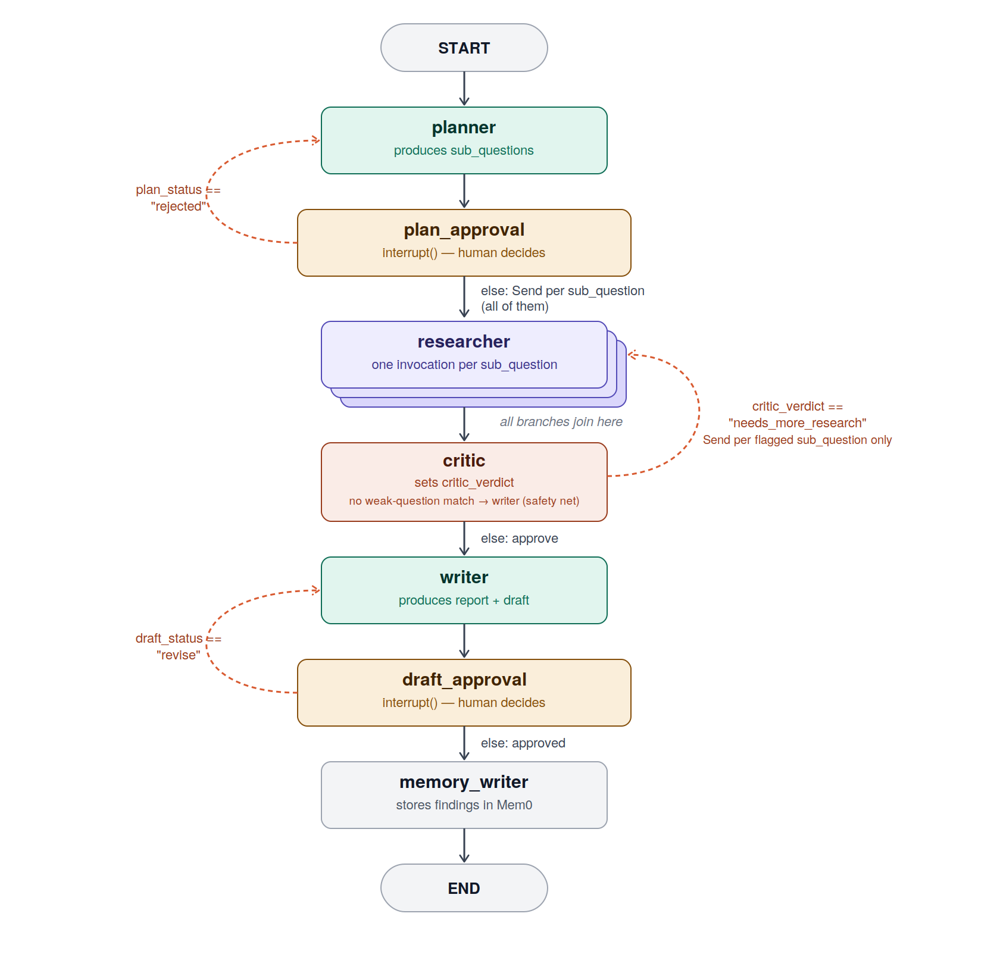
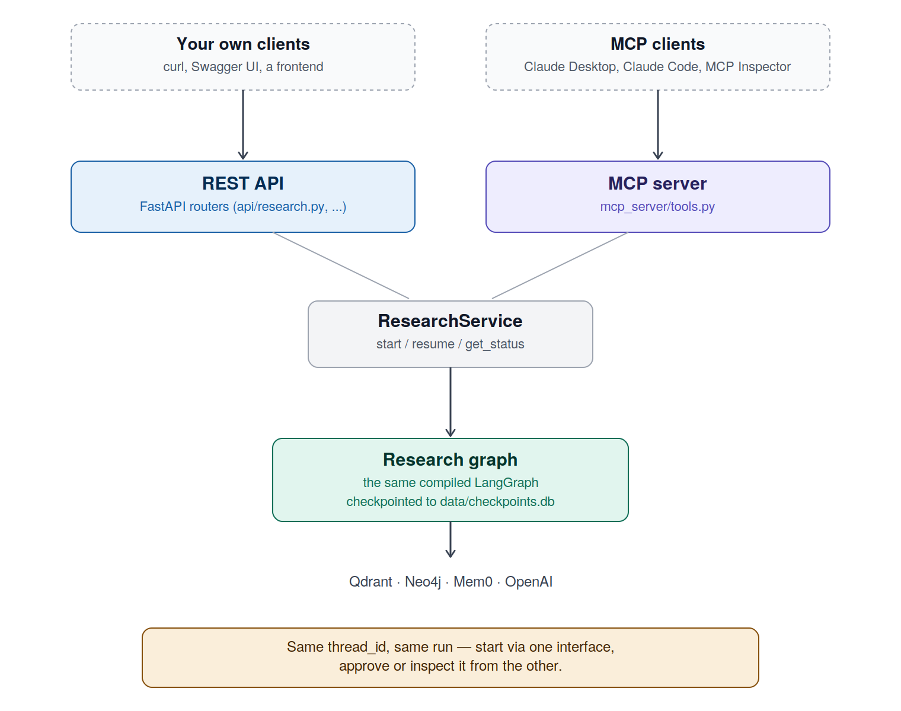

# Autonomous research agent

A multi-agent research system that plans, researches, critiques, and
writes structured reports — pausing for human approval at key steps,
resumable after a restart, and reachable both as a REST API and as an
MCP server.

Give it a research goal. It breaks the goal into sub-questions, researches
each one in parallel using whichever tool fits (your own documents, a
knowledge graph, live web search, or a calculator), has a critic review
the findings and send weak ones back for another pass, and produces a
cited report — checking in with you before research starts and again
before the final report is finalized.

Built as a practice project while working through a Generative & Agentic AI course, using Claude for development and research support — while directing the design, structure, and every tool/library choice myself.

## What this project covers

- **Multi-agent orchestration** — a planner, N parallel researchers, a
  critic, and a writer, each a distinct agent with its own responsibility,
  coordinated through a single LangGraph state machine
- **Planning before execution** — a research goal is decomposed into
  concrete sub-questions before any research happens
- **Dynamic tool selection** — each researcher agent picks its own tool(s)
  per sub-question at runtime (knowledge base, knowledge graph, web search,
  calculator), nothing is hardcoded
- **Parallel execution** — sub-questions are researched concurrently via
  LangGraph's `Send` API, not looped through one at a time
- **A real critic/revision loop** — a critic agent reviews findings for
  gaps, weak sourcing, or contradictions and can send specific
  sub-questions back for another pass, capped to avoid infinite loops
- **Human-in-the-loop** — the graph genuinely pauses (via `interrupt()`)
  for approval before research starts and again before the report is
  finalized, not just a single request/response
- **Checkpointing & resumability** — every run persists to disk; a
  paused or crashed run survives an app restart and resumes exactly
  where it left off
- **Streaming** — node-by-node progress is streamed live via
  Server-Sent Events, instead of waiting silently for a final result
- **Hybrid RAG** — documents are ingested into Qdrant with both dense
  (semantic) and sparse (BM25 keyword) vectors, fused at query time
- **Knowledge graph retrieval** — entities and relationships extracted
  from ingested documents are stored in Neo4j for multi-hop,
  relationship-aware questions
- **Cross-run memory** — findings from completed research are distilled
  into Mem0, so related future research can build on past work
- **Structured, validated output** — every agent's output (the plan, the
  critic's verdict, the final report) is a schema-validated Pydantic
  model, not raw text
- **Dual access** — every action is available both as a REST API and as
  an MCP server, so the same research run is reachable from your own
  client or from Claude Desktop/Claude Code

## How it works

### The agent graph



Each node has one job:

- **`planner`** — breaks the research goal into 3–6 concrete
  sub-questions, checking Mem0 first for relevant findings from past
  research so it doesn't re-plan work that's already been done
- **`plan_approval`** — pauses the graph and hands the proposed plan to
  a human, who can approve it, edit it, or reject it with feedback
- **`researcher`** — answers one sub-question per invocation, choosing
  freely between a hybrid knowledge-base search, a knowledge-graph
  lookup, a live web search, or a calculator; dispatched once per
  sub-question in parallel, and again (only for flagged sub-questions)
  if the critic requests a revision
- **`critic`** — reviews all findings together for gaps, weak sourcing,
  or contradictions across sources, and either approves them or sends
  specific sub-questions back for more research (capped at 2 cycles)
- **`writer`** — synthesizes the approved findings into a structured,
  cited report
- **`draft_approval`** — pauses the graph again and hands the draft
  report to a human, who can approve it or request a revision with
  feedback, which routes back to the writer alone rather than
  restarting the whole pipeline
- **`memory_writer`** — distills the approved findings into Mem0 for
  future research runs to draw on

### Everything shares one system



The REST API and the MCP server are two thin interfaces over the exact
same `ResearchService` and the same checkpointed graph — a run started
through one is fully visible, resumable, and approvable through the
other, since both read and write the same persisted state, keyed by the
same `thread_id`.

## Tech stack

| Layer              | Tools                                                                        |
| ------------------ | ---------------------------------------------------------------------------- |
| Orchestration      | LangGraph (subgraphs, conditional edges, `Send`, `interrupt`, checkpointing) |
| LLM orchestration  | LangChain                                                                    |
| Structured output  | Pydantic AI                                                                  |
| API                | FastAPI (incl. SSE streaming)                                                |
| Vector store       | Qdrant (hybrid dense + sparse search)                                        |
| Knowledge graph    | Neo4j (AuraDB)                                                               |
| Memory             | Mem0                                                                         |
| Protocol server    | MCP                                                                          |
| LLM / embeddings   | OpenAI                                                                       |
| Checkpointing      | SQLite (`langgraph-checkpoint-sqlite`)                                       |
| Package management | uv                                                                           |

## Setup

1. Start Qdrant locally:

   ```bash
   docker compose up -d
   ```

2. Install dependencies:

   ```bash
   uv sync
   ```

3. Copy `.env.example` to `.env` and fill in your OpenAI key and Neo4j
   AuraDB credentials:

   ```bash
   cp .env.example .env
   ```

4. Run the app:

   ```bash
   uv run autonomous-research-agent
   ```

5. Open `http://localhost:8000/docs` to try the REST API, or connect an
   MCP client (Claude Desktop, Claude Code, MCP Inspector) to
   `http://localhost:8000/mcp`.

## Typical flow

1. `POST /research/start` with a research goal — pauses for plan approval
2. `POST /research/{thread_id}/plan` to approve, edit, or reject the plan
3. Research runs in parallel across sub-questions; the critic may send
   some back for revision automatically
4. Once findings are approved, the writer produces a report and the
   graph pauses again
5. `POST /research/{thread_id}/draft` to approve or request a revision
6. `GET /research/{thread_id}/report` for the final Markdown report

Every one of these steps is available identically through the MCP tools
(`start_research`, `approve_plan`, `approve_draft`, `get_report`,
`list_runs`) for use from an MCP client instead of the REST API.

## Notes

- This is a single-operator setup (no auth) by design — a learning and
  portfolio project, not a production deployment.
- Ingested documents are gitignored; each clone starts with an empty
  knowledge base and rebuilds it from whatever you upload.
